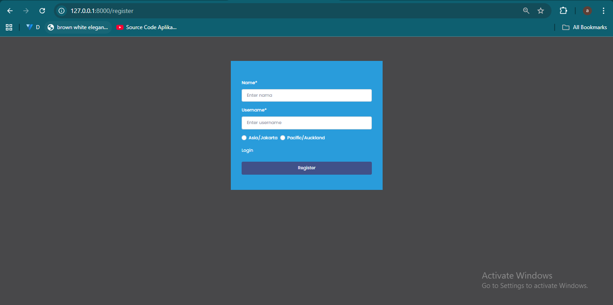
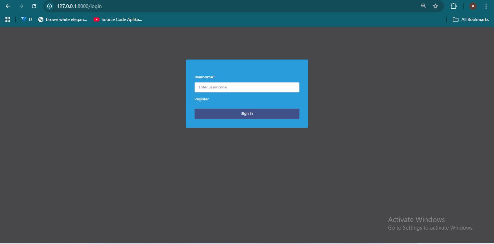
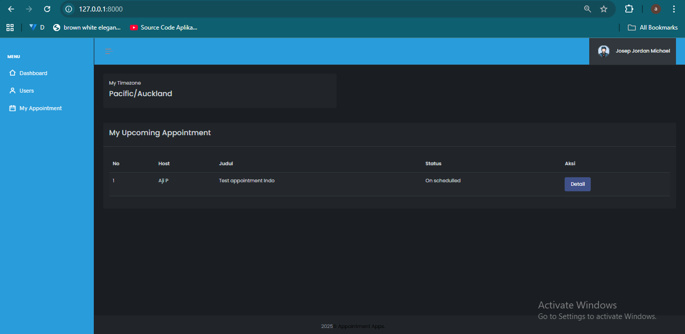
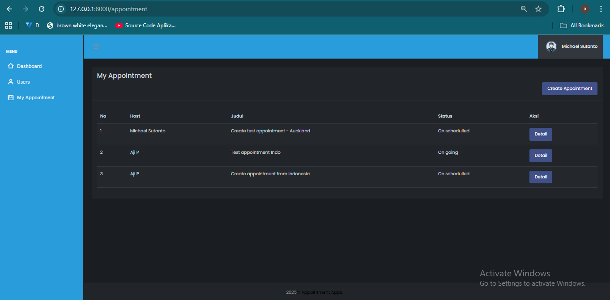
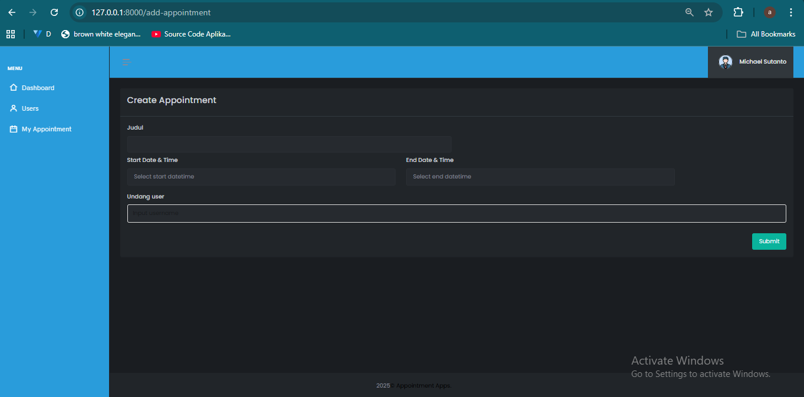

## Overview
Appointment Apps adalah aplikasi untuk membuat, mengatur, dan melihat appointment per pengguna
dengan antar timezone Asia/Jakarta & Pacific/Auckland.


## Tech Stack
- PHP 8.2
- Backend: Laravel PHP
- Frontend: Bootstrap + Javascript
- DB: Postgre
- Version Control : Github


## Fitur
- Registrasi user
- Autentikasi menggunakan JWT
- Menampilkan daftar data pengguna
- Edit profil user
- Membuat appointment dengan berbagai user yang sudah terdaftar
- Melihat semua appointment saya (baik sebagai host atau participant)
- Melihat appointment yang akan datang (baik sebgai host atau participant)


## Setup Database (PostgreSQL)
1. Buat database baru di PostgreSQL, contoh: `appointment_apps`.
2. Import SQL pada file `appointment_apps_db` 
3. Konfigurasikan pada .env anda

DB_CONNECTION=pgsql
DB_HOST=localhost
DB_PORT=5432
DB_DATABASE=appointment_apps
DB_USERNAME=postgres
DB_PASSWORD='YOUR_PASSWORD'

## Instalasi Aplikasi
```bash
git clone https://github.com/ajiparama77/appointment_apps.git
cd appointment_apps
composer install
cp .env.example .env
php artisan serve

```

## Tampilan Aplikasi
1. Register
<p align="center">
  
</p>

2. Login
<p align="center">
  
</p>

3. Home / Upcoming appointment
<p align="center">
  
</p>

4. List Appointment
<p align="center">
  
</p>

5. Create Appointment
<p align="center">
  
</p>

6. List Profile
<p align="center">
  
</p>

7. Edit Profile
<p align="center">
  
</p>

## Demo Aplikasi
1. Fitur Registrasi & Autentikasi
[](public/demo_video/register_auth.mp4)


2. Fitur Daftar User & Edit Profile
[](public/demo_video/profiles_editprofile.mp4)


3. List Appointment & Create Appointment (Invite from timezone Indonesia)
[](public/demo_video/create_appointment_indonesia.mp4)


4. List Appointment & Create Appointment (Invite from timezone Auckland)
[](public/demo_video/create_appointment_auckland.mp4)

